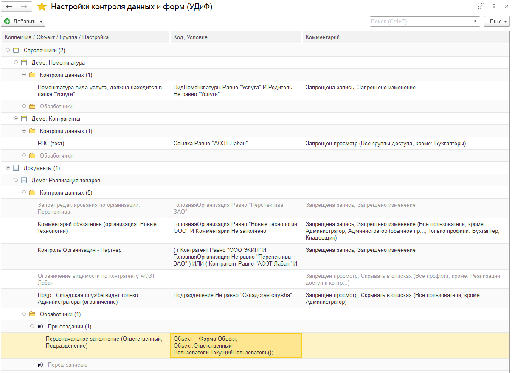

 

**Управление данными и формами (УДиФ)** – это пользовательские проверки, ограничение видимости данных, а также произвольные обработчики событий. Подойдет практически к любой современной конфигурации на управляемых формах. Предназначено для пользователей, администраторов, разработчиков.

**Проект для сбора обратной связи, исходники не публикуются**

# Требования и совместимость
Режим запуска: управляемое приложение, версия платформы 1С:Предприятие 8.3.13 и выше, режим совместимости: 8.3.10 и выше, язык: русский.
Рекомендуется платформа 8.3.15 и выше, Библиотека стандартных подсистем (БСП) 2.4 и выше.

# Основные возможности
* Проверка ввода данных
Настройка произвольных пользовательских проверок данных через удобный интерфейс отборов СКД, а также квалифицированным пользователем с использованием произвольного программного кода при записи объекта.
 
* Контроль доступа к данным
Возможна настройка доступа. В зависимости от настройки пользователь не сможет открыть, изменить данные либо просто не увидит их в списках.
 
* Выполнение произвольных обработчиков: ПриСозданииНаСервере, ПередЗаписью
Возможно выполнение произвольного кода при создании формы. Это позволяет выполнить сложную проверку доступа, а также начальное заполнение или заполнение объектов перед записью

# Решенные проблемы и особенности
* Расширение работает с типами: Справочник, Документ, План видов Характеристик, Задача, Бизнес процесс, План счетов, План видов расчета. 
* Расширение собирается динамически, при установке отмечаются объекты для которых будет работать контроль. В отличии от подобных решений не нужно никаких действий в конфигураторе и при записи тех объектов в которых не нужен контроль никаких действий не производится.
* Иногда бывает что некоторые проверки, обработчики мешают работе или так задумано что они работают не для всех. Часто встречается что проверка должна идти с какой-то даты. Предусмотрены варианты исключения/включения действия на пользователей: Роль, Пользователь, Профили, Группы доступа, Группы пользователей.
* Для отладки можно установить что проверка действует только на текущего пользователя, проверить корректность работы, а потом включить для всех.
* Для программного отключения предусмотрены дополнительные свойства: УДФ_ИгнорироватьПроверкиДанных, УДФ_ИгнорироватьОбработчики. Также предусмотрены роли: Игнорировать все проверки (УДиФ), Игнорировать все обработчики (УДиФ) для полного игнорирования проверок и/или исключений.

# Видео
[Вебинар "Как управлять данными и формами в 1С и избежать ошибок заполнения"](https://www.youtube.com/watch?v=U6cENp94ogA)
 
# Новое в версиях 
[2024.2: скрытие данных в журналах и произвольный запрос в качестве источника настроек](https://infostart.ru/journal/news/mir-1s/infostart-dataformwizard-2024-2-skrytie-dannykh-v-zhurnalakh-i-proizvolnyy-zapros-v-kachestve-istoch_2162794/)

[2024.1: Больше возможностей управления контролями данных. Выгрузка, загрузка настроек](https://infostart.ru/journal/news/mir-1s/infostart-udif-2024-1-bolshe-vozmozhnostey-upravleniya-kontrolyami-dannykh-vygruzka-zagruzka-nastroe_2077290)

